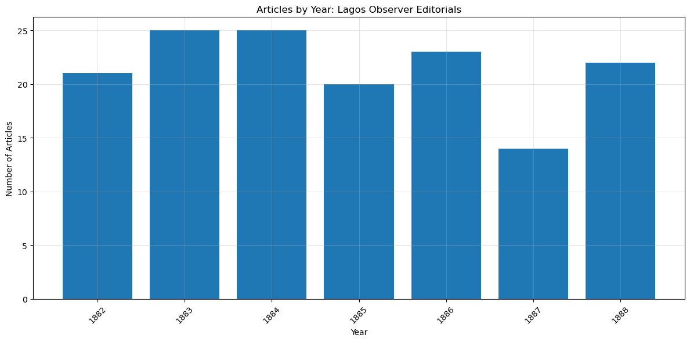
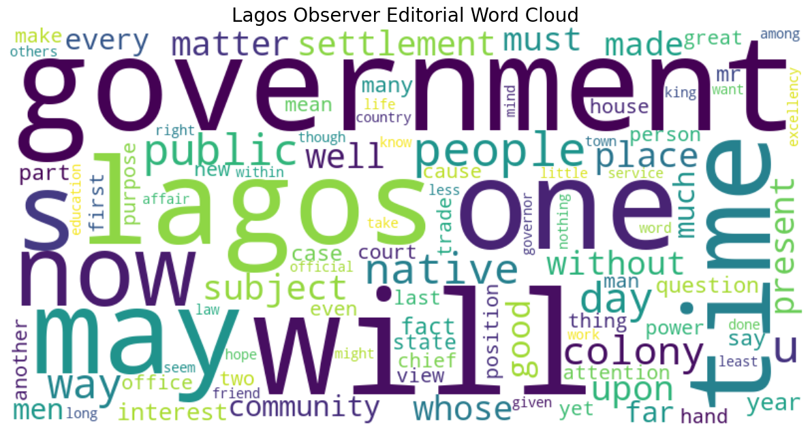
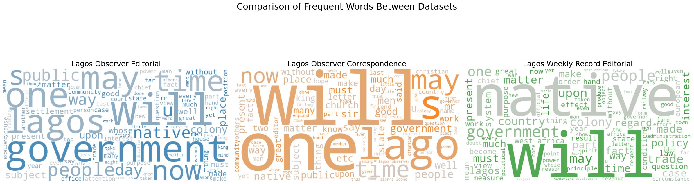
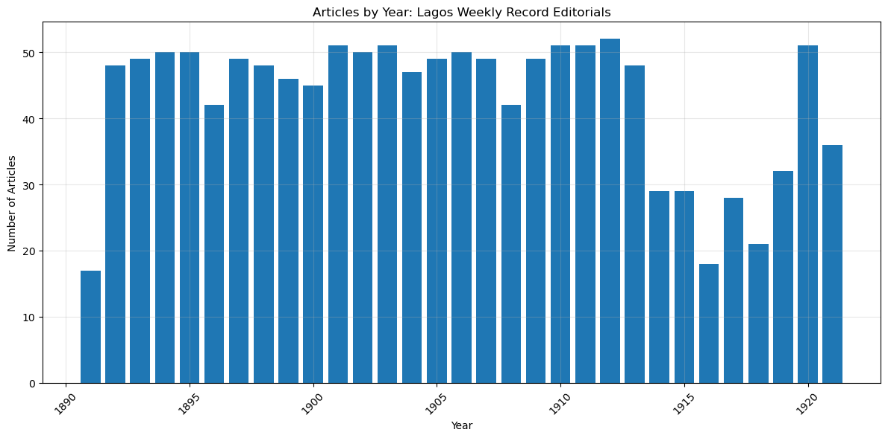

# Counting Worlds: Text Mining Analysis of Early Nigerian Newspapers

[日本語](README_JA.md) | **English**

## Overview

This project provides Python code for text mining analysis of early Nigerian newspapers published in Lagos during the 1880s. It quantitatively analyzes geographical representations, collective identity, and discourse pattern changes during the colonial period.

## Research Background

### Target Newspapers
- **Lagos Observer (LO)** - 1882-1888
  - Editorials
  - Correspondences
- **Lagos Weekly Record (LWR)** - 1891-1930s (this analysis uses early period data)
  - Editorials

These newspapers are among the earliest locally published newspapers in West Africa and are important historical sources for understanding the formation of the colonial public sphere.

## Analysis Methods

### 1. Basic Statistical Analysis
- Time series analysis of article counts
- Monthly and yearly article distribution
- Vocabulary diversity indicators

### 2. Text Mining
- **TF-IDF Analysis**: Extraction of important vocabulary and comparison across periods
- **Topic Modeling (LDA)**: Discovery of latent topics (8-10 topics)
- **Word Clouds**: Visual representation of frequent words

### 3. Geographic Representation Analysis
- Mention frequency by regional category
  - Local (Lagos, Yoruba regions)
  - Regional (West Africa)
  - Continental (Africa)
  - Global (Europe, America, Asia)
- Co-occurrence pattern analysis of geographic categories

### 4. Pronoun Usage Analysis
- Usage patterns of "We/Our" vs "They/Their"
- Formation process of collective identity
- Co-occurrence relationship between pronouns and geographic categories

### 5. Colonial Terminology Analysis
- Frequency and context of "Native" terminology usage
- Changes in terminology usage over time

### 6. Sentiment Analysis
- Sentiment trend analysis of articles using TextBlob
- Sentiment changes by topic and period

## Requirements

```bash
pip install -r requirements.txt
```

Key libraries:
- pandas, numpy (data processing)
- matplotlib, seaborn (visualization)
- scikit-learn (machine learning)
- gensim (topic modeling)
- spacy, NLTK (natural language processing)
- wordcloud (word cloud generation)
- pyLDAvis (LDA visualization)

## Usage

1. Place data files in the `./data/` folder
2. Launch Jupyter Notebook
```bash
jupyter notebook Counting_Worlds_cleaned.ipynb
```
3. Execute cells in order

## Quick Start

You can immediately test the functionality with sample data:

```bash
# Run the demo notebook (choose your language)
jupyter notebook demo_en.ipynb  # English version
jupyter notebook demo_ja.ipynb  # Japanese version
```

**Demo Notebooks:**
- `demo_en.ipynb` - English version with detailed explanations of each cell's functionality
- `demo_ja.ipynb` - Japanese version with detailed explanations of each cell's functionality
- Both notebooks contain identical functionality, only the language differs

Sample data is included in the `sample_data/` folder:
- `sample_editorial.csv` - Editorial data sample (5 articles)
- `sample_correspondence.csv` - Correspondence data sample (5 articles)

## Project Structure

```
counting-worlds-analysis/
├── Counting_Worlds_cleaned.ipynb    # Main analysis notebook
├── demo_en.ipynb                    # Demo notebook (English)
├── demo_ja.ipynb                    # Demo notebook (Japanese)
├── README.md                        # Language selection
├── README_EN.md                     # English README
├── README_JA.md                     # Japanese README
├── requirements.txt                 # Required packages
├── sample_data/                     # Sample data folder
│   ├── sample_editorial.csv         # Editorial samples (5 articles)
│   ├── sample_correspondence.csv    # Correspondence samples (5 articles)
│   └── README.md                    # Sample data description
└── images/                          # Analysis result images
    ├── 1_article_counts_by_year.png
    ├── 2_lagos_observer_wordcloud.png
    ├── 3_datasets_comparison_wordcloud.png
    └── 4_lagos_weekly_record_timeline.png
```

## Unified Data Loader

This project provides a unified data loading function that supports different newspaper formats:

```python
# Use the function defined in Counting_Worlds_cleaned.ipynb, demo_en.ipynb, or demo_ja.ipynb

# Automatic detection
df = load_newspaper_data('your_data.csv')

# Manual specification
df = load_newspaper_data('your_data.csv',
                        data_type='editorial',
                        data_source='Your Newspaper')
```

### Supported Data Formats

| Data Type | Column Structure | Description |
|-----------|-----------------|-------------|
| **Editorial** | id, text, Publication Date, Year, Years | LOE/LWRE format |
| **Correspondence** | no, id_1, text, year, date | LOC format |

### Automatic Conversion

The function automatically performs the following:
- Automatic data type detection from filename
- Column name unification (Publication Date → date, etc.)
- LOC-specific processing: `no` → `id`, `id_1` → `composite_id`
- Metadata addition (data_source, article_type)

## Data Files

### Required CSV File Format
The following are examples of files used in this research (not included in this repository due to copyright):
- LOE format example: `LOE_150_20250422.csv` - Lagos Observer Editorials
- LOC format example: `LOC1882-88_original_divide_20250322_Individual_id.csv` - Lagos Observer Correspondences
- LWRE format example: `LWRE_1328_20250321.csv` - Lagos Weekly Record Editorials

**Note**: Filenames are arbitrary. Any CSV with the same structure (including text, date/year columns) can be used.
- This code was developed for Nigerian newspapers (Lagos Observer, Lagos Weekly Record)
- Files with LOE/LOC/LWR in their names are automatically recognized as these newspaper formats
- For other newspaper data, explicitly specify the article type with the data_type parameter
  Example: load_newspaper_data('your_data.csv', data_type='editorial')

Data format requirements:
- Text column
- Date information (year, month, day)
- Article ID

## Outputs

Analysis results are saved to the following folders:
- `basic_stats/` - Basic statistics
- `text_mining/` - Text mining results
- `geographic_analysis/` - Geographic analysis
- `pronoun_analysis/` - Pronoun analysis
- `visualizations/` - Various graphs and charts

### Sample Results

#### 1. Annual Article Counts


Annual article counts of Lagos Observer editorials (1882-1888)

#### 2. Lagos Observer Editorial Word Cloud


Visual representation of frequent vocabulary. Key words such as "government", "lagos", "people", "native" can be identified.

#### 3. Dataset Vocabulary Comparison


Comparison of vocabulary usage patterns across Lagos Observer editorials, correspondences, and Lagos Weekly Record editorials

#### 4. Lagos Weekly Record Article Timeline


Article count trends for Lagos Weekly Record over a long period (1890-1920s)

## Publications

This code is related to the following research:
- "Counting Worlds: Text Mining Analysis of Geographical Representations in Early Nigerian Newspapers"
- Chapter 7 of "Aspects of Nigeria, an Emerging African Regional Power" (scheduled for publication in 2026)

## License

MIT License

This project is released under the MIT License. The following is permitted:

**Permissions:**
- Free to use for commercial and non-commercial purposes
- Modification and alteration
- Redistribution
- Private use

**Conditions:**
- Copyright notice and license notice must be retained
- The author provides no warranty

### Citation Example

If you use this code, please cite it as follows:

**In Python code:**
```python
# Based on Counting Worlds Analysis by Nozomi Sawada
# https://github.com/nozomi-sawada/counting-worlds-analysis
# MIT License
```

**In academic papers:**
```
Sawada, N. (2025). Counting Worlds: Text Mining Analysis of Early Nigerian Newspapers.
GitHub repository: https://github.com/nozomi-sawada/counting-worlds-analysis
```

## Author

Nozomi Sawada

## Development

This project was developed with assistance from Claude Sonnet 4.5 (Anthropic AI).

## Acknowledgments

This work was supported by JSPS KAKENHI Grant Numbers 19K13372 and 23H00013.

## Notes

- This code is intended for research purposes
- Commercial use is also permitted, but citation is required (MIT License condition)
- Redistribution of data files is restricted due to copyright

## Contact

For inquiries about the research, please use GitHub Issues.
